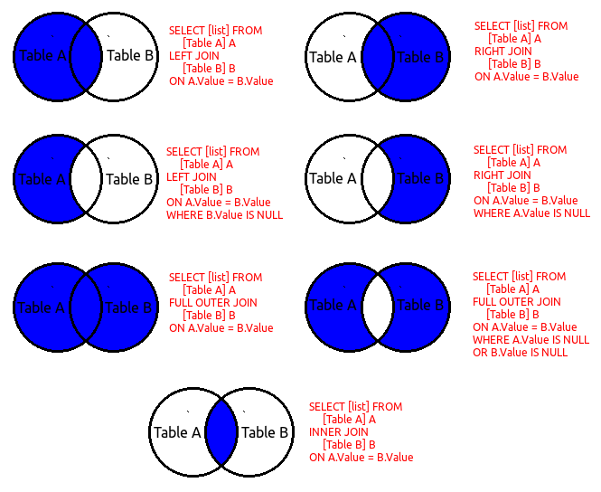

<style>
.reveal section img { background:none; border:none; box-shadow:none; }
</style>

# Who am I?

## Work

* Did a PhD in English from 2013 and freelanced

* Data journalist at *The Times* and *Sunday Times* since 2016

* Data advisor at Global Witness from next month


{width=400px}

---

{width=600px}

---

{width=125px}
{width=125px}
{width=125px}
{width=125px}
{width=125px}
{width=125px}
{width=125px}
{width=125px}
{width=125px}
{width=125px}
{width=125px}
{width=125px}
{width=125px}
{width=125px}
{width=125px}
{width=125px}
{width=125px}

## Interests

* Cyber-crime and the dark net

* Transparency and open data

* Bringing innovative techniques to data journalism

## Tools

* R programming language

* Tidyverse family of packages

* Elasticsearch and Kibana

{width=300px}


# How can programming help us get stories out of data?

## The three As

* Access

* Amalgamation (OK, this one's not great)

* Analysis

## Access

* People talk a lot about creating new data

* Another way to think of it: accessing hidden data

* Examples: web scraping, using APIs, getting data from PDFs and Word documents, working with data bigger than Excel can handle

## Amalgamation

* 2 + 2 = 5

* When combined, data is more than the sum of its parts

* Examples: joins and fuzzy matching, working with weird file formats, tidying data

## Analysis

* How can programming help us *see* stories?

* Visualisation is important, but not the be all and end all

* Examples: geospatial analysis, times series analysis, statistical analysis, search


# Access

## Web scraping

* Getting information from a website into structured form

* 90% of scraping jobs for stories follow this format:

  1. Page through an index to get links to individual items
  2. Load each item and extract some data
  3. Combine the results

---

{width=500px}

---

{width=1200px}

---

{width=1200px}

---

{width=1200px}

---

{width=1200px}

---

## Web scraping

* Key tools: rvest and SelectorGadget

```{r, message = F, warning = F}
library(tidyverse)
library(rvest)

read_html("https://www.thetimes.co.uk/") %>%
  html_nodes(".Item-headline") %>%
  html_text()
```

## APIs

* API: application programming interface

* Structured way for programs to talk to each other

* Lots of organisations provide them: private sector and public sector

---

{width=500px}

---

## APIs

https://www.contractsfinder.service.gov.uk/Published/Notices/OCDS/Search?stages=award&order=ASC&page=1

* Domain: "https://www.contractsfinder.service.gov.uk"

* Endpoint: "/Published/Notices/OCDS/Search"

* Parameter: "stages=award"

* Parameter: "order=ASC"

* Parameter: "page=1"

---

{width=1200px}

---

{width=500px}

---

## APIs

Live demo! https://www.zap-map.com/live/


# Amalgamation

## Joins

* Derived from relational algebra; popularised by SQL databases

* Think of an Excel VLOOKUP function

* Basic but misunderstood...

---



---

## Joins

### Inner joins

* Find matching rows between two tables based on a column

* Create a new table with just the matching rows

### Outer joins

* Find matching rows between two tables based on a column

* Stick the matches from table B on to the right-hand side of table A (or vice versa)

---

{width=800px}

---

## Fuzzy matching

* Data entered by humans is messy

* Louis Goddard / Louis Godard / L Goddard / Goddard, Louis / Mr Louis Goddard

* Needs to be standardised before it can be joined

---

{width=500px}

---

{width=1200px}

---

## Fuzzy matching

```{r}
library(fuzzyjoin)

tax_exiles <- data.frame(
  country = c("Monaco", "monaco", "Switzerland", "Monnaco"),
  year = c(2013, 2014, 2013, 2015),
  tax_exiles = c(56, 23, 245, 35))

countries <- data.frame(
  country = c("Monaco", "Switzerland"))

stringdist_inner_join(countries, tax_exiles, by = "country")
```


# Analysis

## Statistical analysis

* Difficult to write stories based on statistics. Hard to grasp intuitively

* Issues of trust. What constitutes an outlier?

* Visualisation can help, but only so much

---

{width=500px}

---

## Statistical analysis

* Database of blood test results leaked to Insight team and ARD

* Score generated based on consultation with two expert sources

* Suspicious results for medal-winners sent to experts for confirmation

---

## Geospatial analysis

* Huge opportunities: not many data journalists do it well!

* Not all about mapping. Useful for amalgamation of data sources, e.g. how many Xs are there in Y area?

* Benefits from using reproducible workflows rather than graphical GIS software

---

{width=500px}

---

## Geospatial analysis

* Shapefiles of licence areas from Oil and Gas Authority

* Data on commercial and corporate land ownership from Land Registry

* Postcode location data from Ordnance Survey


# Tools

## What is R?

* Developed as a statistical language in the '90s, based on S

* A 'scripting language': used for quickly arranging workflows rather than building software

* Very modular and extensible -- can be adapted for different purposes

## R vs. Python

* Data journalists and academics vs. developers

* Tidyverse vs. Pandas

* Vectors and pipes vs. loops (and other stylistic differences)

* Jupyter vs. RMarkdown

## The R community

* Lots of non-programmers = lots of support available online

* Stack Overflow -- Q&A website

* #rstats hashtag on Twitter

* RStudio Community forum

---

{width=1200px}

---

## RStudio

* Integrated development environment (IDE)

* Basically a text editor with bells and whistles

* Not essential for working with R, but makes it much easier!

## RStudio

* Also the name of the company that *makes* RStudio

* Employs lots of R package developers and maintainers, particularly with Tidyverse packages

* A force for good in the R ecosystem! For now, anyway...

---


---

## Tidyverse

* A collection of packages that work together to make data science (and data journalism) easier

* Key packages: __readr__ (reading and writing data), __dplyr__ (transforming data), __tidyr__ (tidying data), __ggplot2__ (visualisation)

---

{width=350px}

__r4ds.had.co.nz__

---

## RMarkdown

* 'Literate programming' -- code and explanation flow seamlessly together

* Plain-text, human-readable format -- an advantage over Jupyter notebooks

* Output to many different formats: PDF reports, web pages, even slides!


# Data sources

## Companies House

* __Free company data product__

  - Simple CSV with details on every active company
  
  - Name, address, SIC codes, accounts data, etc.

* __Persons with significant control (PSC) snapshot__

  - Big NDJSON file showing people who control UK companies
  
  - Needs a bit of processing, but extremely useful

## Land Registry

* __Commercial and corporate ownership data (CCOD)__

  - Land in England and Wales owned by companies and corporate entities (e.g. government, the Church, etc.)
  
  - Doesn't include reliable geolocation information 😭 (not all addresses have postcodes)

* __Overseas companies ownership data (OCOD)__

  - The same but for overseas companies, generally registered in tax havens like BVI

## Other stuff

* __Cabinet Office open contracting data__

  - API giving details of all contract tenders and awards
  
  - Tussell sells this for £700/month -- and it's all free!

* __Energy Performance Certificate data__

* __Food hygiene rating data__

* Think laterally!