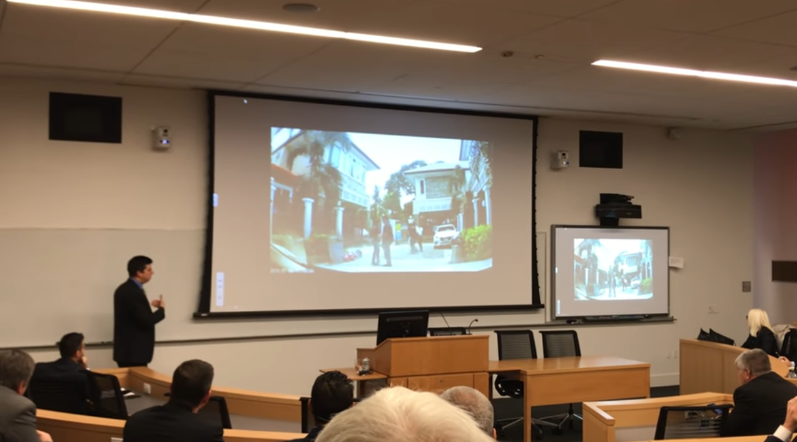

# Introduction

## Who is this guy?

- Data journalist at *The Times* of London

- Use programming (mainly R and Python) to get stories

- Data analysis, web scraping, building custom tools

- Interested in cyber-crime and the dark net

## Last year

- Discussed stories about stolen credentials and dark net markets

- Showed techniques for unmasking drug dealers and paedophiles

- Analysis of PGP keys, linking to social media profiles, etc.

## Last year

## This year

- AlphaBay bust. Why did Cazes get caught?

- Low-hanging fruit theory

- *The 7 Habits of Highly Effective Dark Net Kingpins*

# The AlphaBay Bust

## AlphaBay

- Launched 2014 in 'second wave' of dark net markets: Agora, Evolution, Silk Road 2.0

- Grew after Operation Onymous took out competitors and Agora shut down voluntarily

- By far the biggest market in 2017 - 400k+ users, $600-800k per day in transactions

- Mostly drugs, but also weapons, counterfeit cash and documents, etc.

## AlphaBay

## Alexandre Cazes

- Born 1991 in Quebec, lived in Thailand, married local woman

- Claimed to be freelance programmer, but lived expensive life -- luxury villas, sports cars, etc.

- Well-known in online 'carding' community as alpha02

- Interested in 'pick-up artist' culture -- posted on Roosh V's forum and boasted about wealth

## Alexandre Cazes

## Timeline

- 4 July -- AlphaBay and Hansa go offline

- 5 July -- police raids linked to 'dark web' in Trois-Rivières and Montreal

*[Research, rumours, speculation, FUD...]*

- 12 July -- Cazes hangs himself in Bangkok jail cell

- 13 July -- *Wall Street Journal* describes Cazes as AlphaBay admin, citing 'people familiar with the matter'

## Our story

- Tip-off from source who knew alpha02 from carding forums -- said he was French-Canadian

- Called neighbours in Trois-Rivières after raids -- didn't want to talk!

- Knew we were on right track when name released after suicide

- Dicovered username alex3948 -- lots of posts online about Bitcoin, VPNs, life in Thailand. Key similarities with posts from alpha02, e.g. recommending Mullvad

## How was he caught?

- Used personal email address pimp_alex_91@hotmail.com for welcome emails in early days of market

- Used alpha02 name since at least 2008

- Didn't encrypt administrative machines that were seized

- Lamborghinis!

## In the spotlight

An FBI agent jokes about Cazes' arrest

# Dark net markets vs. law enforcement

## Major busts

- Silk Road, October 2013 -- Ross Ulbricht, a.k.a. 'Dread Pirate Roberts', arrested by FBI

- Operation Onymous, November 2014 -- FBI shuts down Silk Road 2.0, Cloud 9, Hydra in co-operation with Europol

- Operation Bayonet, July 2017 -- AlphaBay and Hansa shut down by FBI and Europol

## Who's still standing?

- Dream -- popular general market. Fifth birthday this month!

- Valhalla/Sikkitie -- Finnish market with English listings. About the same age, but reportedly a 'ghost ship' now with lots of scammers

## My theory

- Law enforcement has picked the low-hanging fruit

- Survival of the fittest -- Dream admins have benefited from being paranoid

- New markets will be increasingly hard to crack

# *The 7 Habits of Highly Effective Dark Net Kingpins*

## Even cyber-criminals need self-help

## 1. Switch it up!

- We linked Cazes to alpha02 because he'd re-used an old username -- FBI found his old email address

- Ross Ulbricht was linked to Dread Pirate Roberts in similar way -- re-used the name 'altoid' in various places, along with a personal email address

- Problem: nobody knows whether their market is going to take off. Need to be paranoid from the start!

## 2. Protect your users!

- Unsafe buyers and sellers = arrests. Arrests give law enforcement inside info about your site 

- Encourage strong encryption for all communications -- don't let users get lazy with automatic, on-market encryption

- Strip metadata from images and other files, retrospectively if necessary (looking at you, Agora...)

- Keep your site secure. AlphaBay exposed private user messages twice due to API flaw.

- But...

## 3. Don't trust your vendors!

- Vendors take real-world risks (e.g. importing/exporting drugs) so are more likely to be arrested

- Many are 'offline' criminals finding their feet online, so have bad OPSEC

- Law enforcement agencies try to 'flip' vendors to get information on market admins. Be very careful whenever communicating with a vendor

## 4. Stick to drugs!

- Illegal drugs are by far the biggest market -- they'll make you the most money

- Dealing in things like weapons allows police to dedicate more resources to taking you down

- The same applies to child abuse imagery and synthetic opiates like fentanyl -- but now you'll also have vigilante hackers on your tail!

## 5. Don't be from North America!

- Europol increasingly focused on cyber-crime, but FBI has most funding, resources and experience

- alpha02 in 2015: "I am absolutely certain that my opsec is secure, and I live in an offshore country where I am safe." Thailand will extradite to the US!

## 6. Don't flash your cash!

- Cazes boasted about wealth online and bought luxury cars

- Unencrypted document on his computer listing 'total net worth' of $23 million, broken down into assets, cash, cryptocurrencies, etc.

## 7. Quit while you're ahead!

- Running a dark net market is a young man's game (why is it always men?)

- 'Exit scams' are common -- just disappear with all your users' money! (Though beware of vigilantes...)

- Police will find it hard to convince bosses to fund an operation against a defunct market

- Don't cash out immediately! Gradually convert crypto-currency into hard assets
