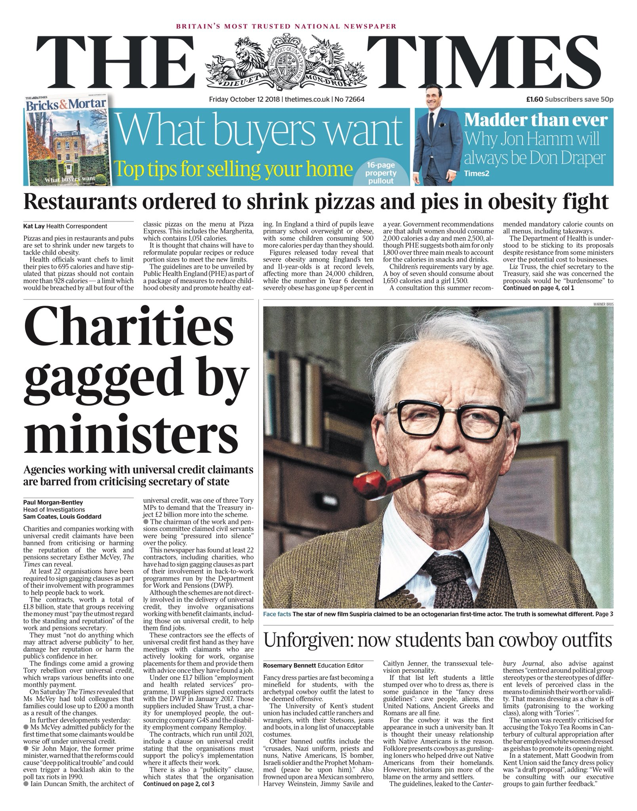

## Who am I?

- Worked as a tech reporter

- Did a digital humanities PhD 

- Joined *The Times* in 2016

- Now work for Global Witness

## 

## { height=690px }

## This morning

- Key differences between *The Times* and Global Witness

- Drill down on differences using example stories

- Think critically about 'impact'

- Questions

## 

- Work with skilled journalists

- Get work done quickly

- (Potentially) high impact

- Impress your mum

## 

- Work with subject experts

- Time to focus on in-depth investigations

- Impact beyond UK

- Still impress your mum (sometimes)

---

| Variable     | Newsroom                | NGO                       |
| ------------ | ----------------------- | ------------------------- |
| *Colleagues* | Experts in storytelling | Experts in subject matter |
| *Pace*       | Fast                    | Slow                      |
| *Stories*    | Quick-hit               | In-depth                  |
| *Impact*     | Wide but shallow        | Narrow but deep           |

## { height=690px }

---

| Variable     | How it worked                                     |
| ------------ | ------------------------------------------------- |
| *Colleagues* | Editor found post on activist's blog              |
| *Pace*       | Wrote script to download documents in a few hours |
| *Stories*    | Three over a few weeks, returning to issue        |
| *Impact*     | Theresa May promised to review                    |

## { height=690px }

---

| Variable     | How it worked                                          |
| ------------ | ------------------------------------------------------ |
| *Colleagues* | Grad scheme reporter wanted to look at industry        |
| *Pace*       | Found bug immediately by chance—published within weeks |
| *Stories*    | One big Sunday package with two stories                |
| *Impact*     | Bug fixed, info handed to NCA                          |

## 

---

| Variable     | How it worked                                               |
| ------------ | ----------------------------------------------------------- |
| *Colleagues* | ST reporters interested; GW researchers gave practical help |
| *Pace*       | >2 years from Vinnik's arrest to publication                |
| *Stories*    | Long article on GW website                                  |
| *Impact*     | Some follow-up + became part of evidence base               |

## 

## 

## <iframe width="100%" height="690px" src="https://www.bbc.co.uk/programmes/p090f6h6/player"></iframe>

---

| Variable     | How it worked                                     |
| ------------ | ------------------------------------------------- |
| *Colleagues* | Knowledge of country, language and available data |
| *Pace*       | ~18 months from idea to publication               |
| *Stories*    | PDF report; companion blog post                   |
| *Impact*     | Commitment from beef company + media coverage     |
